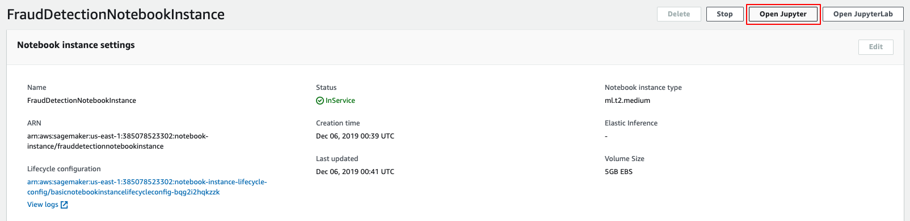
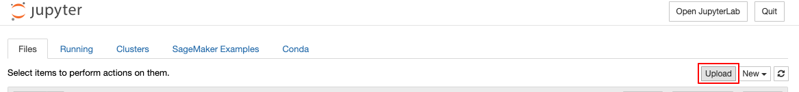

# Guideline 
## Note:
Please note that you are responsible for the cost of the AWS services used while running this solution. See the Cost section for more details. For full details, see the pricing webpage for each AWS service you will be using in this solution. 

## Step 0: set up AWS account, boto3, authentication credentials. 
* **If you doesn’t have an AWS account yet**: please go to [this website]([Amazon Web Services (AWS) -  Cloud Computing Services](https://aws.amazon.com/?nc1=h_ls)), click the button on the upright corner to create a new AWS account. 

* **If you doesn’t know what is boto3, or doesn’t configure authentication credential for boto3 yet**: please go through this [tutorial](https://boto3.amazonaws.com/v1/documentation/api/latest/guide/quickstart.html) and set up boto3 accordingly.
* **If your aws account is subscribing the [free tier](https://aws.amazon.com/free/free-tier-faqs/) price plan**: you may need to request an increase in quota for a more powerful instance (ml.c4.xlarge in this case). Please follow this [guideline](https://docs.aws.amazon.com/general/latest/gr/aws_service_limits.html) to request a quota increase. 
## Step 1: Launch the Stack
Use this [AWS CloudFormation template](https://s3.amazonaws.com/solutions-reference/fraud-detection-using-machine-learning/latest/fraud-detection-using-machine-learning.template) to deploy a sample solution provided by the aws. For the detail, please refer to the step1 of this [tutorial](https://s3.amazonaws.com/solutions-reference/fraud-detection-using-machine-learning/latest/fraud-detection-using-machine-learning.pdf).
## Step 2: Run the sagemaker notebook. 
For the scope of this project,  we made a tradeoff between model performance and low latency: Although xgboost algorithm provides better performance, its high latency is unacceptable for the end user who are limited by budget and couldn’t deploy a powerful instance. In this case, logistic regression is a reasonable alternative.

If you need a solution that avoids a high latency while keeping reasonable performance, please use **sagemaker_logistic.ipynb** in this repository. This notebook is an updated version of the one provided by original template.

If your priority is model performance and is ok with relatively high latency, please contact us, we will provide a tailored solution to you. 

Instruction for Step 2:

* Sign in your aws account and go to the **Amazon Sagemaker console**. 
* On the left side of console, click on **notebook instance**, then click on **FraudDetectionNotebookInstance**, then click on **Open Jupyter**, this will open a new tab for jupiter notebook

* Upload the **sagemaker_logistic.ipynb** to this notebook.

* Run every code cell until **Incremental training** section.
