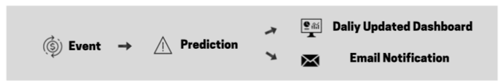

# Supervised Anomaly Detection & Real Time Notification Using Amazon Sagemaker, kinesis, and Quicksight

2019 MSBA 6330 / MSBA 6320 Trends Marketplace

Group members: Zheming Lian, Jiahui Jiang, Shunshun Miao, Pahal Patangia, Fazel Tabassum, Chuchen Xiong

## Project Description

Anomaly detection is a technique used to identify rare items, events, or observations which raise suspicion by differing significantly from most of the data you are analyzing. There are a wide range of applications in different industries including abnormal purchases in retail, cyber intrusions in banking, fraudulent claims in insurance, unusual machine behavior in manufacturing, and even detecting strange patterns in network traffic that could signal an intrusion. Leveraging a solution provided by [aws](https://s3.amazonaws.com/solutions-reference/fraud-detection-using-machine-learning/latest/fraud-detection-using-machine-learning.pdf), we developed an end-to-end anomaly detection workflow starting from data streaming to dashboarding. 

## Details in our workflow 
On a high level, We fit a classification model with historical fraud data and deployed it to a service endpoint. When the streaming data comes in, such endpoint will be invoked and make real time prediction. A notification would be sent out if an anomaly is detected by the algorithm. At the end of each day, a summary dashboard would be automatically updated to reflect the recent pattern of anomal activities, providing insights to stackholder. 

## Dataset used for this demo
In this project, we used a credit card fraud dataset from [Kaggle](https://www.kaggle.com/mlg-ulb/creditcardfraud) as a demo to demonstrate our solution. 

## Handout

## Files

**1.fraud-detection-using-machine-learning.template**

Set up the configuration in CloudFormation

**2.sagemaker_fraud_detection.ipynb**

Train the model in Sagemaker

**3.fraud_testing_resample.ipynb**

Prepare the steaming data to predict

**4.creditcard_sample.csv**

Sample data

## Step

